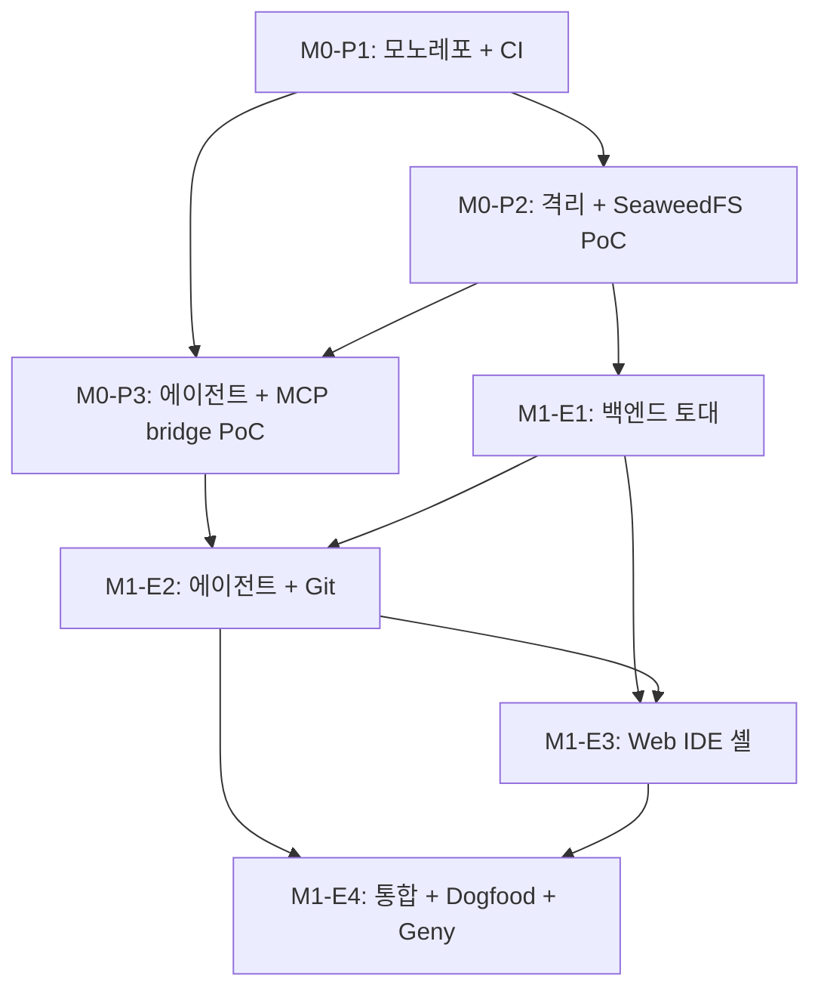

# cycle 의존성 그래프 (Dependencies)

> **상위**: [`00_master_plan.md`](00_master_plan.md)

이 문서는 *어떤 cycle이 어떤 cycle을 *blocking* 하는가*를 한눈에 정리한다. 병렬 실행 가능한 cycle을 식별하고, 단일 *임계 경로(critical path)* 를 노출한다.

---

## 1. 전체 그래프 (M0~M1)



GitHub의 markdown이 mermaid를 렌더링. 수동 렌더링이 필요하면 [mermaid.live](https://mermaid.live) 또는 VSCode 확장.

---

## 2. 단계별 진입 표

| Cycle | 시작 조건 (이전 cycle들 모두 통과) | 병렬 가능? |
|---|---|---|
| M0-P1 | (없음, 최초) | — |
| M0-P2 | M0-P1 | — |
| M0-P3 | M0-P1 + M0-P2 | M0-P2 끝나면 시작 가능, 단 M0-P2의 *runtime 이미지*가 필요해서 직렬 권장 |
| M1-E1 | M0-P2 (격리 검증된 runtime) | M0-P3와 부분 병렬 가능하나 *권장 X* (사용자 1인 운영, 컨텍스트 스위칭 비용) |
| M1-E2 | M0-P3 + M1-E1 | — |
| M1-E3 | M1-E1 (API), M1-E2 (SSE/도구) | M1-E2의 *일부 cycle*과 병렬 가능 (예: 2.1 manifest ship 끝나면 E3의 layout 부분 시작 가능) |
| M1-E4 | M1-E1 + M1-E2 + M1-E3 | — |

---

## 3. 임계 경로 (Critical Path)

```
M0-P1 → M0-P2 → M0-P3 → M1-E1 → M1-E2 → M1-E3 → M1-E4
  3d     5d      5d      12d     10d     12d     10d
```

총합: **57 작업일** (≈ 11~13주, 사용자 1인 약 4d/주 페이스 가정).

병렬화 가능한 부분이 *이론상* 있지만 사용자가 솔로 (메모리 [[project_geny_adapted_project_toolkit]]) 이므로 *직렬 권장*. 컨텍스트 스위칭 비용 > 병렬 이득.

---

## 4. 외부 의존성이 blocker가 되는 시점

| 외부 자원 | blocker 시점 | 미확보 시 영향 |
|---|---|---|
| GitHub 레포 (본 프로젝트용) | M0-P1 시작 시 | 시작 불가 |
| Sysbox runc 설치 | M0-P2 시작 시 | M0-P2 부팅 X |
| 호스트 디스크 30GB | M0-P2 시작 시 | SeaweedFS volume 생성 X |
| 검증용 외부 git 레포 | M0-P2 step 5 | inner compose up 검증 불가 |
| `claude` CLI + Anthropic 토큰 | M0-P3 시작 시 | 에이전트 부팅 X |
| GitHub OAuth App 등록 | M1-E2 cycle 2.5 | Device Flow 동작 X |
| 사용자 prod 서버 (VPS) | M1-E4 cycle 4.1 | RemoteSshTarget 검증 X |
| Geny 레포 접근 권한 | M1-E4 cycle 4.11 | 첫 어댑트 시나리오 X |

이 자원들은 [`00_master_plan.md`](00_master_plan.md) §0.7에 정리.

---

## 5. cycle 안 *세부 단계*가 다른 cycle을 막는 경우

대부분의 의존은 *cycle 단위*이지만, 다음은 *세부 단계 단위*로 더 정밀:

### M1-E2 → M1-E3
- **E2-2.10 SSE 스트림 API** 가 안 끝나면 → E3의 채팅 패널 cycle (3.8 채팅 SSE, 3.9 도구 카드, 3.10 비용 라이브)이 *모킹*만 가능.
- **E2-2.7 `gapt_git`/`gapt_pr`** 도구 가 안 끝나면 → E3의 *diff 카드* (3.6)가 *형식만* 구현, *실 동작*은 E2 종료 후.

권장: E2를 *완전히 끝낸 후* E3 본격 시작. 또는 E3의 *static UI 부분만* 병렬.

### M1-E1 → M1-E2
- **E1-1.9 toolkit-agent 데몬** 이 안 끝나면 → E2의 *모든 도구*가 동작 안 함 (RPC 대상 없음).
- **E1-1.4 Secret Vault** 가 안 끝나면 → E2-2.2 CredentialBundle 빌더 동작 X.
- **E1-1.10 PolicyEngine 골격** 이 안 끝나면 → E2-2.9 정책 훅이 *no-op*만 가능.

권장: E1 cycle 1.1~1.12 모두 통과 후 E2 진입.

---

## 6. M2~M5 의존성 (윤곽)

```
M1 종료
  ↓
M2 (멀티 프로젝트 + 워크트리 + UX)
  ↓
M3 (멀티 사용자 + OIDC + 옵션 모듈)
  ↓
M4 (K8s + 엔터프라이즈)
  ↓
M5 (자동 운영 + 비즈니스 — *선택적*)
```

M3~M5 사이는 *선형 의존 약함*. M4의 일부(예: 컴플라이언스 모듈)는 M3 완료 없이도 가능. 그러나 M2 종료 전엔 M3 epic을 *디테일하게 짜지 않는다* (master plan 규칙).

---

## 7. 외부 종속 — geny-executor PR 사이클

[[feedback_extend_executor_not_adapter_layer]]: 신규 모델/도구가 *executor 본체에* 추가되어야 하면 GAPT cycle이 그 PR을 기다림.

| GAPT cycle | executor에 PR이 필요할 수 있는 시점 |
|---|---|
| M1-E2 cycle 2.7 | `gapt_git`/`gapt_pr`이 *내장 도구로* 들어가야 한다는 결정이 나면 (대안: GaptToolProvider로 충분하면 PR 불요) |
| M1-E4 cycle 4.11 | Geny 어댑트 도중 *예상 못한 도구* 필요 — 즉시 PR + publish 사이클 |
| M3-E6 | 신규 LLM provider (Bedrock, Ollama 등) |
| M5-E2/E3 | sub-pipeline / 모델 라우터 일반화 |

PR ↔ release 사이클: `target=pypi` ([[feedback_geny_executor_publish_workflow]]) 통해 보통 *반나절~하루* 내 받음. 단 *큰 변경*은 별도 cycle화 가능.

---

## 8. 동시 실행 권장 페어 (사용자 시간 절약)

다음 페어는 *작은 시간 손실*로 병렬 가능 — 사용자가 컨텍스트 스위칭이 짧다고 느끼면:

| 페어 | 권장 정도 |
|---|---|
| M0-P2 (호스트 격리) ↔ M0-P3 docs 분석 부분 | ★★★ (분석만 병행) |
| M1-E1 cycle 1.5 (Audit) ↔ cycle 1.10 (Policy) | ★★ (둘 다 도메인 독립적) |
| M1-E3 cycle 3.4 (트리) ↔ cycle 3.7 (터미널) | ★★★ |
| M1-E3 정적 UI 부분 ↔ M1-E2 끝나는 동안 | ★ (모킹 베이스, 추후 통합) |

권장하지 않는 페어 (의존 강함):
- M1-E1 cycle 1.7 (Sandbox) ↔ cycle 1.9 (데몬) — 데몬이 sandbox 안에서 도므로 직렬
- M1-E2 cycle 2.4 (도구) ↔ cycle 2.8 (SessionManager) — manager가 도구 provider 등록 필요

---

## 9. 상태 머신 — cycle 진행

각 cycle의 `Status:` 필드 ([`00_master_plan.md`](00_master_plan.md) §0.3 카드 템플릿):

```
planned ──► in_progress ──► done
   │             │
   │             ├─► blocked (외부 자원 미확보 / executor PR 대기)
   │             │       │
   │             │       └─► in_progress (resolved)
   │             │
   │             └─► deferred (우선순위 변경)
   │
   └─► in_progress
```

`blocked` cycle은 *왜 막혔는지*를 본문에 명시 + 해소 조건. master plan §0.9.

---

## 10. 검증

본 dependencies는 *master plan 인덱스*와 *각 cycle 카드의 `Depends on:` 필드*와 일관되어야. CI에 lint 추가 후보 (M2 이후):

```python
# scripts/check_plan_consistency.py
# 1. 각 cycle 카드의 Depends on:이 실제 존재하는 cycle인가?
# 2. dependencies.md의 그래프가 카드 필드와 일치하는가?
# 3. cycle ID 형식 (M{n}-{P|E}{n}) 일치?
```
